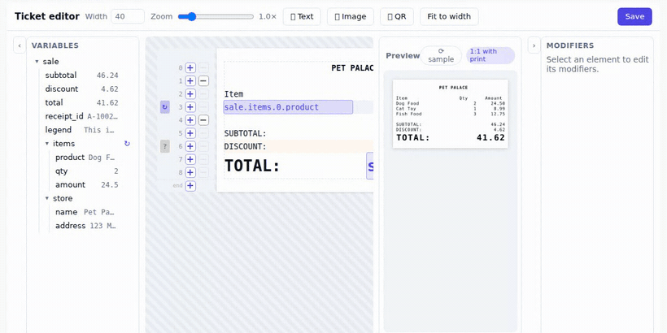
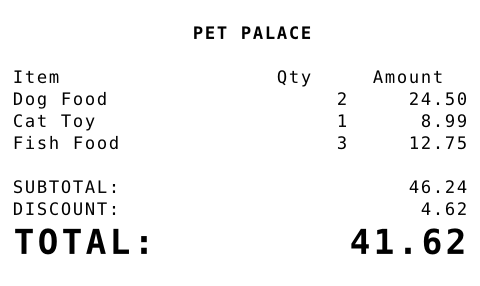
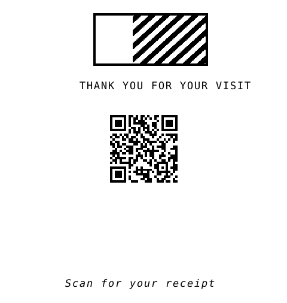
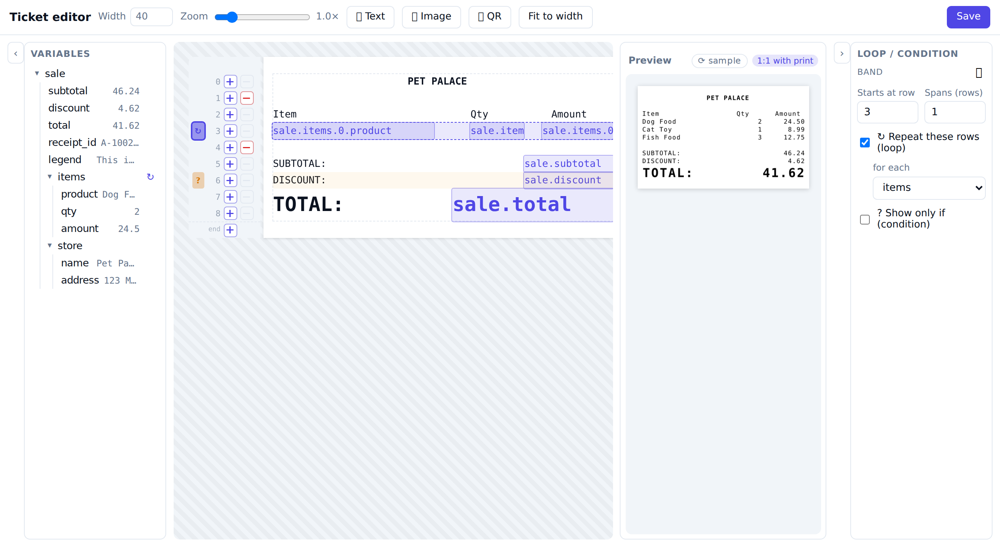

# Ticket Editor

A monospace-grid **receipt / ticket editor** for thermal printers, with a live
preview that is **byte-for-byte identical** to what prints.

**▶ [Try the editor live](https://rsansores.github.io/ticket-editor/)** — it runs
entirely in your browser (the renderer is compiled to WebAssembly; no server).



Design on a grid — drag variables, static text, logos and QR codes; add loops
and conditionals — and the panel on the right shows exactly what the printer will
produce. Because the preview and the print come from the **same renderer**, it's
not an approximation:

<p>
  
  &nbsp;&nbsp;
  
</p>

There is one renderer, written in Rust, compiled twice:

```
                    ticket-core  (the only renderer)
                    ┌───────────────────────────────────┐
                    │  JSON schema → grid layout → PNG   │
                    └───────────────┬───────────────────┘
              native │                              │ wasm
        ┌────────────▼───────────┐      ┌───────────▼────────────┐
        │ your backend           │      │ browser (Vue editor)    │
        │ render PNG → printer    │      │ live 1:1 preview         │
        └────────────────────────┘      └─────────────────────────┘
                    └──────────── identical bytes ──────────┘
```

Because both builds run the same code over the same embedded fonts, the preview
the user edits **is** the print output — parity is a compile target, not two
codebases kept in sync by hand.

## Packages

| Package | What it is | Registry |
|---------|-----------|----------|
| **`ticket-core`** | The Rust renderer + the canonical document schema. Deterministic: same document + data → same PNG bytes. | crates.io |
| **`@ticket-editor/vue`** | The embeddable Vue 3 editor. Bundles the wasm renderer, so consumers need no Rust toolchain. | npm |

The Vue package embeds a WebAssembly build of `ticket-core` for its preview, so
the editor's preview and your backend's print output come from the exact same
renderer.

## The document format

The editor reads and writes a versioned **JSON `TicketDoc`** — the single source
of truth. Everything is measured in **character cells**, never raw pixels: a
variable reserves a fixed number of columns, and its value is truncated or padded
to exactly that width, so a real value can never overflow its slot and shove the
layout around.

```jsonc
{
  "version": 1,
  "paper": { "width_chars": 40, "cell_width_px": 12, "cell_height_px": 22, "font_px": 20 },
  "regions": [
    { "id": "loop", "start_row": 3, "end_row": 4, "source": "sale.items" },
    { "id": "disc", "start_row": 6, "end_row": 7,
      "condition": { "var": "sale.discount", "op": "gt", "value": "0" } }
  ],
  "elements": [
    { "id": "t",  "row": 0, "col": 15, "type": "text", "content": "PET PALACE", "style": { "bold": true } },
    { "id": "p",  "row": 3, "col": 0,  "type": "variable", "path": "product", "length": 18 },
    { "id": "tv", "row": 7, "col": 20, "type": "variable", "path": "sale.total", "length": 19, "align": "right",
      "number": { "decimals": 2, "rounding": "half_up", "thousands": true }, "style": { "scale": 2 } }
  ]
}
```

- **elements** — placed at a `(row, col)`. A `text` element is literal; a
  `variable` pulls a value from your data at render time; there are also `image`
  (PNG logo, reduced to 1-bit) and `qr` (from a value) elements.
- **regions** — row-bands with flow behaviour: a `source` makes the band a
  **loop** (repeats once per array item, everything below reflows down); a
  `condition` makes it **conditional** (collapses when false).

## Frontend: the Vue editor

```bash
npm i @ticket-editor/vue vue vue-i18n
```

```vue
<script setup lang="ts">
import { ref } from 'vue'
import { TicketEditor } from '@ticket-editor/vue'
import '@ticket-editor/vue/styles.css'
import type { TicketDoc } from '@ticket-editor/vue'

const doc = ref<TicketDoc>({ version: 1, paper: { width_chars: 40 }, elements: [] })

// Sample (or real) data — drives the variable tree and the preview values.
const sale = {
  sale: {
    subtotal: 46.24, discount: 4.62, total: 41.62,
    items: [
      { product: 'Dog Food', qty: 2, amount: 24.5 },
      { product: 'Cat Toy',  qty: 1, amount: 8.99 },
    ],
  },
}

async function persist(d: TicketDoc) {
  // Store the JSON however you like (this is the library user's responsibility).
  await fetch('/api/ticket-templates', { method: 'POST', body: JSON.stringify(d) })
}
</script>

<template>
  <TicketEditor v-model="doc" :variables="sale" :on-save="persist" />
</template>
```

### `<TicketEditor>` props

| Prop | Type | Purpose |
|------|------|---------|
| `v-model` (`modelValue`) | `TicketDoc` | The document. The editor keeps a private copy and emits snapshots — it never mutates your object. |
| `variables` | `Record<string, unknown>` | Sample or real data. Builds the variable tree and fills the live preview. |
| `variableTypes` | `Record<string, 'text'\|'number'\|'date'>` | Authoritative variable types keyed by dotted path. Gates which formatting the editor offers (numbers as numbers, dates as dates). Anything omitted is inferred from the sample. |
| `locale` | `string` | Force a UI language (`'en'`, `'es'`). If omitted, follows the host's `vue-i18n` locale. |
| `messages` | `Messages` | Override or extend the built-in UI strings, keyed by locale. |
| `on-save` | `(doc: TicketDoc) => void \| Promise<void>` | Called by the Save button. Persist the JSON wherever you want. |

### Theming

The editor styles itself entirely through the **shadcn CSS-variable contract**
(`--color-primary`, `--color-background`, `--radius`, …) with neutral fallbacks.
Embedded in an app that defines those tokens, it inherits the host look
automatically; standalone it uses the defaults. It has **no dependency on any
host UI kit**.

### Internationalization

Built-in English and Spanish, in a local `vue-i18n` scope that **follows the
host's locale** automatically (no wiring). Override any string via the
`messages` prop. `vue-i18n` is a peer dependency (shared with your app, not
bundled twice).

## Backend: rendering to a PNG

```toml
# Cargo.toml
ticket-core = "0.1"
```

```rust
use ticket_core::{render_png, TicketDoc};

// `doc` is the JSON you stored; `data` is the real sale as a serde_json::Value.
let doc: TicketDoc = serde_json::from_str(stored_json)?;
let png: Vec<u8> = render_png(&doc, &data)?;   // 1:1 with the browser preview
// send `png` to your printer (CUPS, ESC/POS raster, …)
```

`ticket-core` takes plain data (a `TicketDoc` and a `serde_json::Value`) and
returns PNG bytes — no database, framework, or printing coupling. It defends
against adversarial documents (bounded image/QR/canvas sizes, clamped decimals,
no panics on hostile input).

> **Print sizing:** set `cell_width_px` so `width_chars × cell_width_px` equals
> your printer's dot width (e.g. 384 dots for 58 mm, 576 for 80 mm) — then the
> preview is 1:1 with the paper.

## Features

- Monospace grid; **char-length reservation** so values never overflow their slot.
- **Text size** (1×–4× integer magnification, thermal-printer style), bold /
  italic, vertical align + a fractional **nudge** (super/subscript, ™/©).
- **Number** formatting (decimals, rounding method, thousands) and **date**
  reshaping; type-aware (offered only where it applies).
- **Text wrap** (word-aware) within a fixed column band.
- **Logos** (PNG, reduced to 1-bit by threshold or Floyd–Steinberg dithering) and
  **QR codes** (from a literal or a variable).
- **Loops** over repeatable arrays and **conditionals**, with content reflow —
  authored via a git-style lane and configured in the side drawer.
- Non-destructive editing: free placement, insert/remove rows, overflow zone,
  overlap flags, "fit to width".

Loops and conditionals are marked in a git-style lane next to the rows and
configured in the drawer — no template language to learn:



## Repository layout

```
crates/ticket-core     # the renderer + schema (native + wasm), the crates.io package
crates/ticket-wasm     # wasm-bindgen wrapper (build tool; produces the browser bundle)
packages/ticket-editor # the Vue editor (@ticket-editor/vue), embeds the wasm
scripts/build-wasm.sh  # rebuild the browser wasm bundle from ticket-core
```

## Develop

```bash
# Renderer (native): tests + a sample PNG
cargo test -p ticket-core
cargo run -p ticket-core --example sample -- /tmp/sample.png   # basic receipt
cargo run -p ticket-core --example flow   -- /tmp/flow.png     # loop + condition
cargo run -p ticket-core --example media  -- /tmp/media.png    # logo + QR

# Renderer (wasm): the browser bundle is a GENERATED artifact, not committed to
# git — build it once before running the editor, and again after changing ticket-core:
./scripts/build-wasm.sh    # needs `rustup target add wasm32-unknown-unknown`
                           # and `cargo install wasm-bindgen-cli --version <matches wasm-bindgen>`

# Editor (standalone demo with hot reload)
cd packages/ticket-editor
npm install
npm run build:wasm    # first-time bootstrap (needs the Rust toolchain above)
npm run dev           # http://localhost:5199

# Lint / typecheck
cargo clippy --all-targets            # (crate denies clippy::all)
cd packages/ticket-editor && npm run lint && npm run type-check
```

The wasm bundle is built from `ticket-core` and is **not checked in** — it's a
derived artifact. CI rebuilds it for the live demo, and `npm publish` bundles a
fresh build automatically (the package's `prepack` script runs `build:wasm`), so
a published release can never ship a stale renderer. When releasing, publish the
crate and the npm package **from the same `ticket-core` version** so your backend
(native) and the editor (wasm) render identically.

## License

MIT OR Apache-2.0.
